<div align="center">

# Blitzwing

### The decentralized brain that runs on the world's spare computers — and pays them for it.

**Blitzwing is an OpenAI-compatible large-language-model inference network with no data center behind it.**
A model is sliced layer-by-layer across a swarm of ordinary, volunteer machines. Anyone — even a
**CPU-only laptop with no GPU** — can host a handful of layers and get paid in **HBAR** for every request
they help compute. Every payment is settled and audited on **Hedera**. Every node carries a verifiable
on-chain identity on **ENS**. Nothing about the supply chain is something you have to take on faith.

[](#-license)
[](#-getting-started)
[](#-getting-started)
[](#-hedera)
[](#-ens)
[](#supported-models)

```bash
npm i -g blitzwing && blitzwing
```

*One command. No repo clone. No port forwarding. No GPU. Start earning from idle compute in minutes.*

</div>

---

## What is Blitzwing, really?

Running a modern language model usually means renting a rack of GPUs from a handful of cloud
providers. That concentrates cost, control, and trust in very few hands. Meanwhile, hundreds of
millions of perfectly capable computers sit idle for most of the day — gaming PCs between sessions,
laptops overnight, servers at 5% utilization.

**Blitzwing turns that idle capacity into a single, shared inference engine.** Instead of one machine
holding an entire model, the model's layers are spread across many machines. When a request comes in,
it flows through those machines in order — each one computing only the layers it holds — and the
finished answer comes out the other end. To the caller it looks exactly like a normal OpenAI
`/v1/chat/completions` endpoint. Under the hood, a dozen strangers' computers might have just
collaborated to produce that single response.

Two things make Blitzwing more than a clever networking trick:

1. **You get paid, automatically, per request.** A consumer pays for an inference using the **x402**
   payment protocol over **Hedera**. The moment their payment settles, inference runs, and then every
   machine that contributed layers is paid **HBAR proportional to how many layers it hosted** — with a
   tamper-evident receipt written to the **Hedera Consensus Service**. No invoicing. No payout portal.
   No human in the loop.

2. **Nothing is "trust me."** Every node has a name on **ENS** (Ethereum Name Service) that publishes,
   on-chain, exactly which layers it serves and which Hedera account it's paid to. Every payout lands
   on Hedera's public ledger. A consumer — or a skeptical judge, or a competing operator — can
   independently verify on **two separate public ledgers** that a given machine computed a given slice
   of a given request and was paid the exact amount claimed.

> **The one-sentence pitch:** Blitzwing is a marketplace where idle hardware becomes verifiable,
> automatically-paid inference capacity — priced on Hedera, named on ENS, and open to anyone with a
> laptop and a Hedera account.

### Why a GPU-less laptop can still earn

This is the part people find surprising, so it's worth being explicit. You do **not** need a GPU to
participate. The default model Blitzwing serves, `HuggingFaceTB/SmolLM2-360M-Instruct`, is small
enough that a handful of its 32 layers run comfortably on a plain CPU. When you join, the wizard asks
**how many layers your machine can host** — you might take 4, or 8, or 12 — and from then on your
machine simply computes that slice whenever a request routes through it. Your earnings scale with the
number of layers you host and the number of requests that flow through the swarm. A bigger machine can
take a bigger slice; a modest laptop takes a smaller one. Everyone with spare cycles has a place.

And because Blitzwing opens a free, outbound **Cloudflare Quick Tunnel** for you automatically, you do
**not** need a public IP, port forwarding, a static address, or any router configuration. If your
laptop can reach the internet, it can earn.

---

## Important Links

### Project links

| What | Link |
|------|------|
| **Live app** (Swarm Console) | https://blitzwing-lemon.vercel.app/ |
| **npm package** | https://www.npmjs.com/package/blitzwing |
| **Project showcase** (ETHGlobal) | https://ethglobal.com/showcase/blitzwing-zbe18 |

### Deployed contracts & accounts (Hedera Testnet)

| What | Identifier | Explorer |
|------|-----------|----------|
| **Blitzwing Escrow** (payout splitter) | `0.0.10424668` | [HashScan →](https://hashscan.io/testnet/contract/0.0.10424668) |
| Escrow — EVM address | `0x00000000000000000000000000000000009f115c` | [HashScan →](https://hashscan.io/testnet/address/0x00000000000000000000000000000000009f115c) |
| **Mother account** (fee payer + escrow operator) | `0.0.9211480` | [HashScan →](https://hashscan.io/testnet/account/0.0.9211480) |
| Example consumer (payer) account | `0.0.6111100` | [HashScan →](https://hashscan.io/testnet/account/0.0.6111100) |
| **HCS audit topic** (memo `blitzwing-payouts`) | `0.0.10503363` | [HashScan →](https://hashscan.io/testnet/topic/0.0.10503363) |

### ENS identity (Ethereum Sepolia — ENSv2 Beta, chain `11155111`)

| What | Address / Name | Explorer |
|------|----------------|----------|
| **Parent name** | `blitzwing.eth` | [Sepolia ENS app →](https://sepolia.app.ens.domains/blitzwing.eth) |
| **ENS operator** (mints + updates subnames) | `0x633469aF77696393387B4a72ec0Ed0ABf52b6f4a` | [Etherscan →](https://sepolia.etherscan.io/address/0x633469aF77696393387B4a72ec0Ed0ABf52b6f4a) |
| Parent `.eth` registration | `0xa15344c28679e198563446a76b26a80e13a20a10dc866dacb626a5147cc58427` | [Etherscan →](https://sepolia.etherscan.io/tx/0xa15344c28679e198563446a76b26a80e13a20a10dc866dacb626a5147cc58427) |
| Operator resolver (deployed) | `0x9Cb1307c8548680Edd4D726E06b16C4280016394` | [Etherscan →](https://sepolia.etherscan.io/address/0x9Cb1307c8548680Edd4D726E06b16C4280016394) |
| Parent user registry (deployed) | `0xb9BD3f3Ba18867009BAbF917100e94bc5dF7b035` | [Etherscan →](https://sepolia.etherscan.io/address/0xb9BD3f3Ba18867009BAbF917100e94bc5dF7b035) |
| ETH Registrar | `0xa88553f454b77203b0d036a05c894d555eaaa2cc` | [Etherscan →](https://sepolia.etherscan.io/address/0xa88553f454b77203b0d036a05c894d555eaaa2cc) |
| ETH Registry | `0xbdc85dd5b15d7ecb354cd7cb6f2c50b4f2c4f0e2` | [Etherscan →](https://sepolia.etherscan.io/address/0xbdc85dd5b15d7ecb354cd7cb6f2c50b4f2c4f0e2) |
| Root Registry | `0x8115186e8f2e0b0281e86ab91f0f48ba90364354` | [Etherscan →](https://sepolia.etherscan.io/address/0x8115186e8f2e0b0281e86ab91f0f48ba90364354) |
| Universal Resolver (proxy) | `0xeEeEEEeE14D718C2B47D9923Deab1335E144EeEe` | [Etherscan →](https://sepolia.etherscan.io/address/0xeEeEEEeE14D718C2B47D9923Deab1335E144EeEe) |
| Permissioned Resolver (impl) | `0x9eae5c2730a7dd16bdd1dee6421a1b91e3b0365e` | [Etherscan →](https://sepolia.etherscan.io/address/0x9eae5c2730a7dd16bdd1dee6421a1b91e3b0365e) |
| User Registry (impl) | `0x624a25d67b59d587752ebec8dded8827dae52050` | [Etherscan →](https://sepolia.etherscan.io/address/0x624a25d67b59d587752ebec8dded8827dae52050) |
| Verifiable Factory | `0x10dc6333cdfe1fcef624c6e0a8221b91804cd7ef` | [Etherscan →](https://sepolia.etherscan.io/address/0x10dc6333cdfe1fcef624c6e0a8221b91804cd7ef) |
| MockUSDC (registrar fee token) | `0x768f42455a2d082e23ceef7d51e5787c82d67a39` | [Etherscan →](https://sepolia.etherscan.io/address/0x768f42455a2d082e23ceef7d51e5787c82d67a39) |

### Live network endpoints

| Service | URL | Notes |
|---------|-----|-------|
| Discovery Service | `http://34.70.57.65:9000` | Baked as the CLI default; override with `BLITZWING_DISCOVERY_URL`. |
| x402 Payment Gateway | `http://34.9.229.188:8000` | Public paid-inference gate. |

> Deployed endpoints run on ephemeral cloud IPs and may change between demos. **Prefer the CLI's
> baked-in default** or set `BLITZWING_DISCOVERY_URL` instead of hardcoding an IP anywhere.

### Important transactions (demo run — 2026-09-12)

Live settlement for request `chatcmpl-4a8dc0ebd91842f2a3a455ed` (32 layers × 10_000_000 tinybars;
mother 20 + contributor `host-7186124901ec` 4 + contributor `host-d3bcc8dc8762` 8):

| Event | Transaction / ID | Explorer |
|-------|------------------|----------|
| x402 payment settled into escrow | `0.0.9211480@1789229445.699641675` | [HashScan →](https://hashscan.io/testnet/transaction/0.0.9211480@1789229445.699641675) |
| Escrow `release()` payout to contributors | `0.0.9211480@1789229507.349000902` | [HashScan →](https://hashscan.io/testnet/transaction/0.0.9211480@1789229507.349000902) |
| HCS audit message (per request) | topic `0.0.10503363` @ `1789229518.857315744` | [HashScan →](https://hashscan.io/testnet/topic/0.0.10503363/messages?p=1&k=1789229518.857315744) |
| ENS subname mint (`host-71861249.blitzwing.eth`) | `0x77f13e9f506cfdfe6fffc474dc7b30c5df538abc1365ce20bc5044275fbb0b95` | [Etherscan →](https://sepolia.etherscan.io/tx/0x77f13e9f506cfdfe6fffc474dc7b30c5df538abc1365ce20bc5044275fbb0b95) |
| ENS resolver record update (`mother.blitzwing.eth` rebalance) | `0xf59e629a9d439c10350d790a6d633e45bd0669b822b4e5552af52ff2f60eda80` | [Etherscan →](https://sepolia.etherscan.io/tx/0xf59e629a9d439c10350d790a6d633e45bd0669b822b4e5552af52ff2f60eda80) |

### Repository & code map

| Resource | Where in the code |
|----------|-------------------|
| Source repository | https://github.com/Marshal-AM/blitzwing |
| CLI package (npm) | `npm i -g blitzwing` · [`packages/cli/`](packages/cli) · [`packages/cli/README.md`](packages/cli/README.md) |
| Orchestrator / mother (routing, payouts, ENS sync) | [`orchestrator/app/`](orchestrator/app) |
| x402 + Hedera core loop | [`packages/x402-gateway/index.ts`](packages/x402-gateway/index.ts) · [`packages/x402-facilitator/`](packages/x402-facilitator) |
| Hedera payouts, escrow & HCS | [`orchestrator/app/hedera_payouts.py`](orchestrator/app/hedera_payouts.py) · [`orchestrator/app/hedera_escrow.py`](orchestrator/app/hedera_escrow.py) |
| Escrow contract (Hedera EVM) | [`contracts/contracts/BlitzwingEscrow.sol`](contracts/contracts/BlitzwingEscrow.sol) |
| ENS identity backbone | [`packages/ens-service/src/`](packages/ens-service/src) · [`orchestrator/app/ens_client.py`](orchestrator/app/ens_client.py) |
| Layer rebalance mechanics | [`orchestrator/app/registry.py`](orchestrator/app/registry.py) · [`shard_manager/`](shard_manager) |
| Consumer clients (free, paid, ENS verifier) | [`examples/`](examples) |

---

## Table of Contents

- [What is Blitzwing, really?](#what-is-blitzwing-really)
  - [Why a GPU-less laptop can still earn](#why-a-gpu-less-laptop-can-still-earn)
- [Important Links](#important-links)
  - [Project links](#project-links)
  - [Deployed contracts & accounts (Hedera Testnet)](#deployed-contracts--accounts-hedera-testnet)
  - [ENS identity (Ethereum Sepolia — ENSv2 Beta, chain `11155111`)](#ens-identity-ethereum-sepolia--ensv2-beta-chain-11155111)
  - [Live network endpoints](#live-network-endpoints)
  - [Important transactions (demo run — 2026-09-12)](#important-transactions-demo-run--2026-09-12)
  - [Repository & code map](#repository--code-map)
- [Introduction](#introduction)
  - [The problem: inference is centralized and expensive](#the-problem-inference-is-centralized-and-expensive)
  - [The vision: a shared brain made of idle machines](#the-vision-a-shared-brain-made-of-idle-machines)
  - [Who earns, and how](#who-earns-and-how)
  - [The two personas](#the-two-personas)
  - [The trust model: don't trust, verify](#the-trust-model-dont-trust-verify)
- [System Architecture](#system-architecture)
  - [Bird's-eye view](#birds-eye-view)
  - [The roles in the network](#the-roles-in-the-network)
  - [Layer splitting and pipeline parallelism](#layer-splitting-and-pipeline-parallelism)
  - [The swarm DHT and peer discovery](#the-swarm-dht-and-peer-discovery)
  - [Routing and inference: how a token is born](#routing-and-inference-how-a-token-is-born)
  - [Joining and the "shrink and hand off" handoff](#joining-and-the-shrink-and-hand-off-handoff)
  - [Fault tolerance, heartbeats, and rebalancing](#fault-tolerance-heartbeats-and-rebalancing)
  - [The OpenAI-compatible API surface](#the-openai-compatible-api-surface)
  - [Networking without port forwarding](#networking-without-port-forwarding)
  - [Component and port map](#component-and-port-map)
  - [Supported models](#supported-models)
  - [The Swarm Console web UI](#the-swarm-console-web-ui)
  - [Repository layout](#repository-layout)
- [Hedera](#hedera)
  - [Why Hedera](#why-hedera)
  - [x402: pay-per-inference over HTTP 402](#x402-pay-per-inference-over-http-402)
  - [The payment gateway and the facilitator](#the-payment-gateway-and-the-facilitator)
  - [Contributor payouts: layer-weighted and automatic](#contributor-payouts-layer-weighted-and-automatic)
  - [The Blitzwing Escrow contract](#the-blitzwing-escrow-contract)
  - [The HCS audit trail](#the-hcs-audit-trail)
  - [Mirror Node and HashScan verification](#mirror-node-and-hashscan-verification)
  - [Wallet signing: HashPack and beyond](#wallet-signing-hashpack-and-beyond)
  - [Hedera configuration reference](#hedera-configuration-reference)
  - [Where Hedera is heading in Blitzwing](#where-hedera-is-heading-in-blitzwing)
- [ENS](#ens)
  - [Why ENS, and the two-chain split](#why-ens-and-the-two-chain-split)
  - [The host identity backbone](#the-host-identity-backbone)
  - [The resolver record schema](#the-resolver-record-schema)
  - [Lifecycle hooks: identity that tracks the swarm](#lifecycle-hooks-identity-that-tracks-the-swarm)
  - [The payout verification gate](#the-payout-verification-gate)
  - [The ENS service](#the-ens-service)
  - [Who pays for ENS](#who-pays-for-ens)
  - [ENS configuration reference](#ens-configuration-reference)
  - [Designed for ENSv2: the primitives we build on](#designed-for-ensv2-the-primitives-we-build-on)
- [Getting Started](#getting-started)
  - [Prerequisites](#prerequisites)
  - [Join the network as a contributor](#join-the-network-as-a-contributor)
  - [Consume inference](#consume-inference)
- [Roadmap](#roadmap)
- [Frequently Asked Questions](#frequently-asked-questions)
- [Conclusion](#conclusion)
- [License](#license)

---

## Introduction

### The problem: inference is centralized and expensive

The economics of running large language models are brutal and concentrating. Serving a model of any
real size requires high-end accelerators, and those accelerators are scarce, expensive, and owned by a
small number of cloud providers. The result is a market where:

- **Cost is gated by hardware you can't easily get.** GPU supply is constrained, and the machines that
  are available command premium rents.
- **Control is concentrated.** A few providers set the prices, the rate limits, the content policies,
  and the availability of the endpoints that a growing share of the software world now depends on.
- **Trust is implicit.** When you call a hosted inference API, you have no way to know which machine
  actually ran your request, whether it was the model you asked for, or where your money went. You
  trust the brand.
- **Idle capacity is wasted.** At the same time, an enormous pool of capable consumer and prosumer
  hardware sits unused for the overwhelming majority of every day.

This is the gap Blitzwing exists to close.

### The vision: a shared brain made of idle machines

Blitzwing's core idea is simple to state and surprisingly deep to build: **split a model across many
machines, route each request through them in sequence, and pay each machine for the work it did.**

A language model is, structurally, a stack of repeated layers (also called blocks). The default model
Blitzwing serves has 32 of them. There is no rule that says all 32 must live on one computer. If
machine A holds layers 0–11, machine B holds 12–23, and machine C holds 24–31, then a request can flow
A → B → C and produce exactly the same output as if one machine had held all 32. The only cost is the
network hop between them — and for a small model on modern internet links, that cost is modest.

Now add economics. Because each machine holds a known slice of the model, and because each request has
a known price, it becomes possible to pay each machine **exactly in proportion to the layers it
contributed.** Add a public ledger, and those payments become verifiable. Add a naming system, and each
machine becomes a first-class, resolvable identity rather than an anonymous IP. That is Blitzwing:

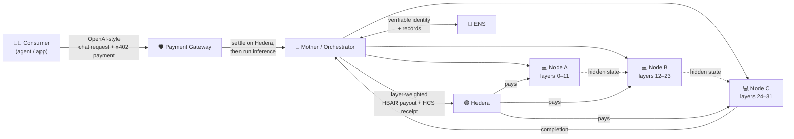

### Who earns, and how

There are three ways to participate in Blitzwing, and two of them can make you money:

| You are… | What you do | What you get |
|----------|-------------|--------------|
| **A contributor** | Run `blitzwing` and host some model layers on your machine. | **HBAR, per request**, proportional to the number of layers you host. The more layers and the more traffic, the more you earn. |
| **An operator** | Run the mother/orchestrator, gateway, escrow, and ENS services for a model. | The operator position: you take payment from consumers and it's released to contributors through the escrow; you can configure fees and run the economy for your model. |
| **A consumer** | Call the OpenAI-compatible endpoint and pay per request. | Cheap, auditable inference, plus a cryptographic receipt proving exactly who computed your answer. |

A contributor's earnings are delightfully mechanical: if a request costs `N` layers × the per-layer
price, and you host `k` of those layers, you receive `k × per-layer-price` for that request. Host more
layers, earn more per request. Stay online through more requests, earn more in total.

### The two personas

Blitzwing's design is best understood through the two people it's built for. These stories come
straight from the project's own user-story doc, and each one produces **on-chain proof that anyone can
check** — no trust in Blitzwing required.

**Story 1 — "I want to earn HBAR with my spare PC."** Dana has a **CPU-only PC with no GPU** that sits
idle most of the day. Even without a graphics card, she can host a handful of the model's layers. She
installs the CLI, tells it how many layers her machine can handle, and gives it her Hedera
account ID. The operator mints her a company-owned ENS name — `host-abc123.blitzwing.eth` — and
publishes her layer range and payout account as on-chain records. Her machine starts serving. When a
request routes through her, she's paid HBAR within seconds, and she can open HashScan or the HCS audit
topic to see a consensus-timestamped entry `{requestId, ens_name, amount, txId}` proving she was paid
for that exact request. No invoicing, no dashboard login, no "we'll pay you next month."

**Story 2 — "I want cheap inference I can actually audit."** Sam is building an AI agent and wants an
OpenAI-compatible endpoint — but wants to *see* who computed the answer. He sends a chat request, gets
back a `402 Payment Required` with a price, his x402 client auto-pays over Hedera, and the request is
retried with proof of payment. The response comes back with a **receipt/manifest** listing exactly
which ENS-named hosts computed which layers and the Hedera transaction IDs for each payout. Sam resolves
one of those ENS names to confirm it's a real registered identity with a real Hedera account, then
checks the transaction on the Mirror Node to confirm the payout actually landed. Two public ledgers,
zero trust in Sam's API provider.

### The trust model: don't trust, verify

Most "decentralized" systems ask you to trust a private database that claims to be decentralized.
Blitzwing's entire design is arranged so that the important claims are checkable against public
infrastructure you don't control:

- **"This node exists and serves these layers"** → resolvable on **ENS** (Sepolia).
- **"This node was paid this amount for this request"** → a transaction on **Hedera** you can open on
  the Mirror Node or HashScan.
- **"This is what happened, at this time"** → a consensus-timestamped message on the **Hedera
  Consensus Service**, independent of Blitzwing's own logs.

The orchestrator's internal registry is what actually *routes* traffic — that's a performance decision.
But the *truth* of the system lives on two public ledgers, which is exactly why a consumer, a
contributor, or a skeptical third party can verify every claim without asking Blitzwing to prove
anything.

---

## System Architecture

### Bird's-eye view

Blitzwing is composed of a small number of cooperating services. Some run once for the whole network
(discovery), some run per model (the mother/orchestrator and its payment rail), and some run on every
participating machine (the shard manager that supervises the local compute engine). The diagram below
shows the full topology; the sections that follow unpack each piece.

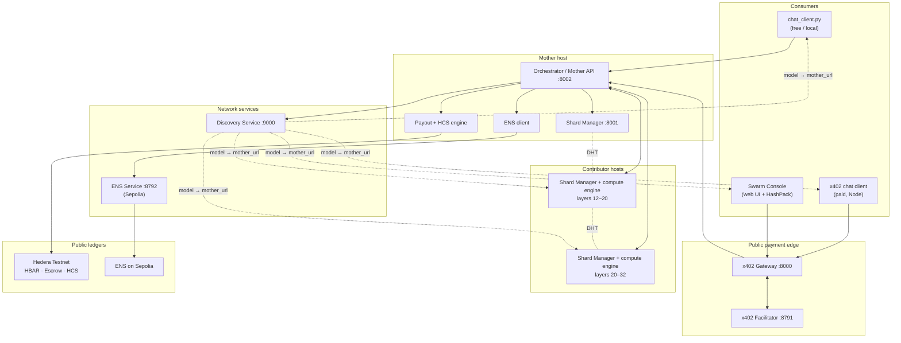

### The roles in the network

| Role | Where it runs | Responsibility |
|------|---------------|----------------|
| **Discovery Service** | One small always-on box per network | A registry mapping `model → mother_url`. It's how a contributor or consumer finds the right swarm without hardcoding an IP. Backed by SQLite; writes are admin-token-gated. |
| **Mother / Orchestrator** | One host per model | The brain. It bootstraps the swarm holding *all* layers, carves ranges off to joiners, keeps the authoritative host registry, exposes the OpenAI-compatible API, routes inference, and runs payouts, HCS audit, and ENS sync. |
| **Shard Manager** | Every participating machine (mother and contributors) | A lightweight supervisor sidecar that starts, stops, and **reloads** the local compute engine with a given layer range, and drives the multi-hop forward pass. This is the piece that makes live rebalancing practical. |
| **Contributor** | Any volunteer machine | Runs the `blitzwing` CLI, which brings up a shard manager + compute engine serving a contiguous slice of layers. Earns HBAR per request. |
| **x402 Gateway** | In front of the orchestrator | The public payment gate. Enforces x402 payment on chat requests before forwarding them to the orchestrator. |
| **x402 Facilitator** | Alongside the gateway (private) | Verifies and settles x402 payments on Hedera. The fee-payer for settlement. |
| **ENS Service** | Alongside the orchestrator (private) | Mints ENS subnames and writes resolver records on Sepolia for each host. The orchestrator talks to it over HTTP; contributors never touch Sepolia. |
| **Consumer clients** | Anywhere | Free/local Python client, paid Node client, or the web-based Swarm Console with a HashPack wallet. |

### Layer splitting and pipeline parallelism

The heart of Blitzwing is how it carves a model across machines. Layers are tracked as simple integer
ranges written `"start:end"`, half-open, so the whole 32-layer model is the range `"0:32"`. Each host
holds a **contiguous** slice, and the union of all slices must cover `0:total_layers` with no gaps and
no overlaps. The orchestrator's registry is the source of truth for who holds what.

When the mother first boots, it holds the entire model:

```
Layers:  0 ───────────────────────────────────────────────── 32
Mother:  [0 ─────────────────────────────────────────────── 32)
```

As contributors join, the mother **carves ranges off the high end of the largest current holder**
(the "largest donor"). Suppose one contributor asks to host 12 layers and another asks for 8:

```
Layers:  0 ──────────────── 12 ──────────── 20 ───────────── 32
Mother:  [0 ────────────── 12)
Node A:                     [12 ────────── 20)
Node B:                                    [20 ──────────── 32)
```

The model is now served cooperatively by three machines, and coverage is complete the entire time.
This is **pipeline parallelism by layer range**: a request enters at layer 0, flows forward through
each holder in order, and the final holder (the "tail") produces the output tokens.

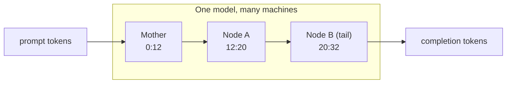

A few important invariants the registry enforces:

- **Only one pending join at a time.** If two joins were carving simultaneously, the second could
  shrink a donor past a range the first had already reserved, punching a hole in coverage. The registry
  serializes joins to make that impossible.
- **Bounds.** A contributor may host between `1` and `total_layers − 1` layers — never the whole model
  (there must always be a donor), never zero.
- **Effective ranges.** Carving accounts for ranges already reserved by in-flight joins, so the "largest
  donor" calculation is always against the *effective* (post-reservation) range.

### The swarm DHT and peer discovery

Machines in a Blitzwing swarm find and talk to each other over a **libp2p-based distributed hash table
(DHT)**. The mother bootstraps a fresh swarm and advertises its bootstrap multiaddresses; every joiner
receives those addresses as its `initial_peers` and announces the blocks it serves into the DHT. This
is what lets a request discover a live path through the layers even as machines come and go.

Before the orchestrator accepts a new host into live routing, it performs **block-visibility
verification**: it polls the DHT until every block in the newcomer's range is actually visible as a
served span. Only then is the handoff finalized. This prevents a half-started node from creating a gap
in coverage — if verification fails within the timeout, the join is released and the contributor can
retry cleanly.

Identity of a node on the wire is a stable libp2p peer ID, persisted to disk so a machine keeps the
same identity across restarts. The orchestrator tracks each host's peer multiaddress alongside its
layer range, so it always knows both *what* a host serves and *how* to reach it.

### Routing and inference: how a token is born

Blitzwing supports two complementary inference paths. Which one is used depends on the shape of the
swarm.

**1. The HTTP-chain path (primary for NAT'd swarms).** Most volunteer machines sit behind home
routers and can't accept arbitrary inbound connections. To make those machines first-class
contributors anyway, Blitzwing can drive generation over plain HTTP between the shard managers. The
orchestrator picks the **tail contributor** (the host holding the highest layer range) as the
conductor and hands it the prompt plus the full swarm manifest. The tail then drives generation
token-by-token:

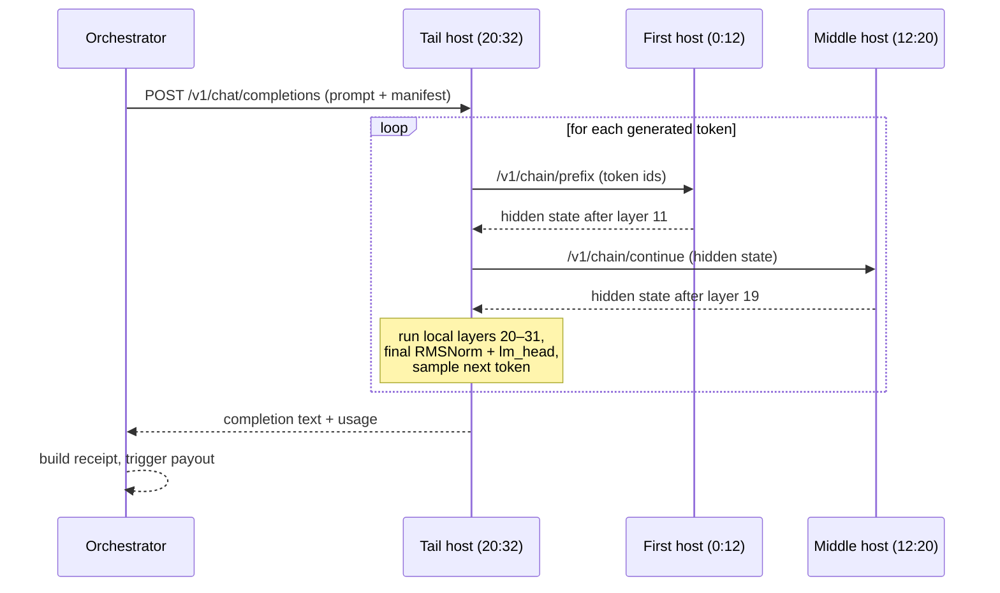

Hidden states are serialized between hops with a compact tensor codec. The tail applies the model's
final normalization and language-model head **only on itself**, then samples the next token using the
request's temperature, top-p, and repetition settings, and loops. This design means no machine ever has
to accept an inbound connection from the mother — every hop is an outbound HTTP call, which is exactly
what NAT and Cloudflare tunnels allow.

**2. The direct swarm-client path.** When a viable direct route through the DHT exists (for example a
mother-only or public-IP swarm), the orchestrator uses a distributed client that loads the model
across the swarm and generates directly, including token streaming. This path is used when it's
available and efficient.

In both cases the orchestrator first builds and validates a **swarm manifest**: it reconciles the
registry against each host's live status, adopts live block ranges if a host has drifted, and confirms
the manifest covers `0:total_layers` contiguously before any inference runs.

### Joining and the "shrink and hand off" handoff

Adding a machine to a live swarm without dropping coverage is the trickiest part of the system, and
it's where Blitzwing adds custom orchestration on top of the raw compute engine. The sequence is a
careful "shrink and hand off":

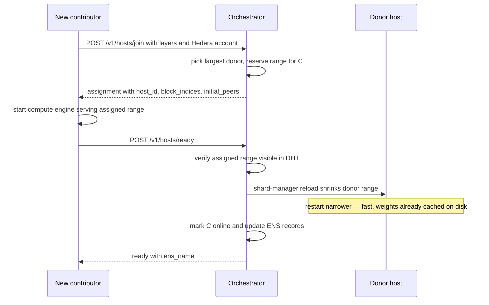

The key practical insight, documented in the rebalance notes, is that **restarting a compute server
with a narrower range is fast**, because the layer weights are already cached on disk — there's no
re-download, just a reload with new arguments. That's what makes live, demonstrable rebalancing
possible instead of a multi-minute stall. The newcomer's download of its own layers is the only
unavoidable wait, which is why a small, CPU-friendly model is used for the live experience.

Throughout the handoff, coverage is never broken: the donor keeps serving its full range until the
newcomer is verified serving its slice, and only then does the donor shrink.

### Fault tolerance, heartbeats, and rebalancing

Volunteer machines are, by definition, unreliable — they sleep, they lose wifi, they get closed
mid-session. Blitzwing treats churn as the normal case, not the exception.

- **Heartbeats.** Every contributor runs a small detached daemon that POSTs `/v1/hosts/heartbeat`
  roughly every **20 seconds**, reporting liveness, its live block range, and its peer address.
- **The reaper.** The orchestrator runs a reaper loop every **15 seconds**. Any online host that has
  gone silent longer than the heartbeat TTL (**60 seconds** by default) is declared dead, and its
  layers are **reclaimed**. Pending joins that never completed are also swept.
- **Reclaim and merge.** When a host dies or leaves, its layer range must be re-covered. The
  orchestrator prefers to return the range to the mother, or merges it into an adjacent or largest
  donor by calling that donor's shard-manager `/reload` with the widened range. Helpers keep the
  resulting coverage contiguous.
- **Persistence.** The registry is persisted to disk, so host assignments survive an orchestrator
  restart rather than forcing the whole swarm to re-handshake.

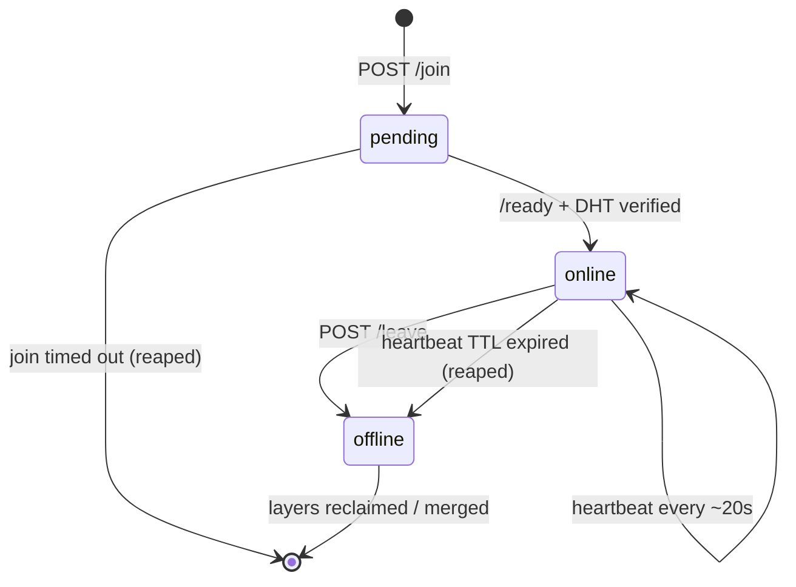

The net effect: a consumer's request always routes over a coverage-complete swarm, a contributor who
vanishes simply stops earning and has their layers absorbed back, and a contributor who returns can
re-join cleanly.

### The OpenAI-compatible API surface

Blitzwing speaks the API your tools already know. The orchestrator exposes a standard
OpenAI-compatible surface plus the swarm-management endpoints that make the network tick.

| Method & path | Purpose |
|---------------|---------|
| `POST /v1/chat/completions` | OpenAI-compatible chat, streaming (SSE) and non-streaming. Paid responses carry a `blitzwing_payment` receipt. |
| `GET /v1/models` | List served models. |
| `GET /v1/hosts` | Live host map: each host's role, layer range, status, Hedera account, ENS name, ENS-verified flag, and `max_layers_available`. |
| `GET /v1/swarm/manifest` | The ordered layer-span manifest and whether coverage is complete. |
| `POST /v1/hosts/join` | Reserve a layer range for a new contributor. |
| `POST /v1/hosts/ready` | Finalize the handoff once the contributor is serving. |
| `POST /v1/hosts/heartbeat` | Liveness + live block report. |
| `POST /v1/hosts/leave` | Graceful departure; layers reclaimed. |
| `POST /v1/internal/payout` | Trigger the layer-weighted payout for a settled request (guarded; requires proof of settlement when x402 is enabled). |
| `GET /health` | Model-loaded status, peers, pricing, x402 flag, layer availability. |

The chat request/response shapes mirror OpenAI's: `model`, `messages`, `max_tokens`, `temperature`,
`top_p`, `stream`, `stop` on the way in; `choices`, `usage`, and standard `chat.completion` objects on
the way out. The one Blitzwing-specific addition is the optional `blitzwing_payment` field on a paid
response — a receipt object carrying the request ID, the x402 transaction ID, the payout transaction
ID, the HCS topic and sequence number, the per-layer cost, the total, and the per-host breakdown.

### Networking without port forwarding

A decentralized network is only as big as the machines that can actually join it, and most machines
are behind NAT. Blitzwing offers three networking paths, in order of how much setup they require:

1. **Cloudflare Quick Tunnel (the default product path).** The CLI opens a free, account-less
   Cloudflare tunnel that gives your local shard manager a public HTTPS URL. No port forwarding, no
   static IP, no token. This is what lets a home laptop participate. All inference hops to your machine
   are outbound-initiated HTTP, which tunnels handle perfectly.
2. **Public IP / cloud VM.** If you run on a VM with a public address, the wizard can announce your
   address directly and skip the tunnel — the best path for always-on production contributors. You
   open inbound TCP on the swarm port and the shard-manager port.
3. **Dev-only tunnels (ngrok).** Used only for local debugging when a second public VM isn't handy;
   not the product path.

Native Windows is **not** supported for contributing, because the compute engine requires Linux.
Windows users run everything inside **WSL**, which the CLI detects and guides.

### Component and port map

| Component | Default port | Notes |
|-----------|--------------|-------|
| Public gateway / mother API | `8000` | Consumer entry point. |
| Mother shard manager | `8001` | Supervises the mother's compute engine. |
| Internal orchestrator | `8002` | Behind the gateway for paid flows. |
| Discovery service | `9000` | `model → mother_url` registry. |
| Swarm P2P (compute engine) | `31337` | libp2p DHT + block serving. |
| x402 facilitator | `8791` | Verify/settle service. |
| ENS service | `8792` | Sepolia identity sidecar. |

On a Windows + WSL machine running alongside other services, contributors shift to `8011` (shard
manager) and `31338` (P2P) automatically to avoid collisions.

### Supported models

The deployed, demo-ready default is **`HuggingFaceTB/SmolLM2-360M-Instruct`** — a 32-layer,
instruction-tuned model small enough to run on CPU, which is precisely why a GPU-less laptop can
contribute. Because the tail host applies the model's final RMS normalization and language-model head,
the runtime handles Llama/SmolLM2-style architectures correctly end-to-end.

The architecture itself is **model-agnostic**. Discovery is keyed by model, each model carries its own
`total_layers`, and the underlying compute engine supports multiple model families — including BLOOM,
Falcon, Llama, Mixtral, and Qwen3. Swapping in a different model is a matter of pointing a mother at it
and registering it with discovery. The product simply ships SmolLM2-360M as the model that makes the
"join with a laptop, see it work in seconds" experience real.

### The Swarm Console web UI

Blitzwing ships a polished web application — the **Swarm Console** — built with TanStack Start (React
19, Vite, server-side rendering) and deployed to Vercel. It does two things:

- **Live visualization.** It polls the real network and renders the swarm as a set of animated nodes
  wired together, labeled by ENS name and role (mother, relay, tail), showing online-vs-total hosts,
  the block ranges each holds, whether the manifest is complete, and the live mother URL. It's the
  clearest way to *see* a distributed inference happen.
- **Paid chat with a real wallet.** Connect a **HashPack** wallet (via WalletConnect), type a prompt,
  hit **Run**, and the console signs an **x402 payment client-side** and posts it through the gateway.
  When the answer comes back, it shows the streamed tokens and the `blitzwing_payment` receipt — the
  full pay-to-compute loop, in a browser.

### Repository layout

For contributors who want to read the code, here's how the repository is organized:

| Path | What lives there |
|------|------------------|
| `orchestrator/` | The mother service: OpenAI-compatible API, host registry, layer carve/rebalance, payouts, HCS audit, and ENS sync. The brain of a swarm. |
| `shard_manager/` | The per-machine supervisor sidecar — starts/stops/reloads the local compute engine and drives the multi-hop HTTP forward pass. |
| `discovery_service/` | The tiny `model → mother_url` registry service. |
| `packages/cli/` | The published `blitzwing` npm package (the contributor wizard + bundled runtime). |
| `packages/x402-gateway/` | The public x402 payment gate. |
| `packages/x402-facilitator/` | The x402 verify/settle service for Hedera. |
| `packages/ens-service/` | The Sepolia ENS identity sidecar. |
| `contracts/` | The `BlitzwingEscrow.sol` contract and its deploy tooling (Hardhat). |
| `web-ui/` | The Swarm Console (TanStack Start + HashPack). |
| `examples/` | Consumer clients: free Python, paid Node, and the standalone ENS receipt verifier. |
| `scripts/` | Operator and contributor ops scripts (bootstrap, join, recover, provision). |

The beauty of the contributor experience is that **none of this matters to you as a joiner** — the CLI
ships everything it needs inside the npm package. You never clone the repository to contribute; you
only read it if you want to understand or improve the network.

---

## Hedera

Hedera is Blitzwing's money and memory: it's where inference is paid for, where contributors are paid
out, and where an independent, tamper-evident record of every payout lives. Everything in this section
runs on **Hedera Testnet** today.

> **📂 Hedera in the code** — every claim in this section is backed by source you can open:
>
> | What | File |
> |------|------|
> | Layer-weighted HBAR payouts + HCS audit log | [`orchestrator/app/hedera_payouts.py`](orchestrator/app/hedera_payouts.py) |
> | Smart-contract escrow release (EVM) | [`orchestrator/app/hedera_escrow.py`](orchestrator/app/hedera_escrow.py) |
> | `BlitzwingEscrow.sol` contract + Hardhat deploy | [`contracts/contracts/BlitzwingEscrow.sol`](contracts/contracts/BlitzwingEscrow.sol) · [`contracts/scripts/deploy.js`](contracts/scripts/deploy.js) |
> | x402 payment gateway (verify → settle → proxy → payout) | [`packages/x402-gateway/index.ts`](packages/x402-gateway/index.ts) |
> | x402 facilitator + Hedera signer (verify/settle, Mirror Node) | [`packages/x402-facilitator/index.ts`](packages/x402-facilitator/index.ts) · [`packages/x402-facilitator/hedera-signer.ts`](packages/x402-facilitator/hedera-signer.ts) |
> | JVM bridge for `hedera-sdk-py` | [`orchestrator/app/hedera_jvm.py`](orchestrator/app/hedera_jvm.py) |
> | Hedera config / env settings | [`orchestrator/app/config.py`](orchestrator/app/config.py) |
> | Paid Node consumer (402 → pay → retry) | [`examples/x402_chat_client/index.ts`](examples/x402_chat_client/index.ts) |
> | Browser HashPack paid chat | [`web-ui/src/`](web-ui/src) |

### Why Hedera

Blitzwing needs a settlement layer with a very specific profile, and Hedera fits it unusually well:

- **Fast, final settlement.** Payments and payouts need to clear in seconds so a consumer isn't left
  waiting and a contributor sees earnings almost immediately. Hedera's consensus gives fast finality
  without the probabilistic waiting of many chains.
- **Low, predictable fees.** Micropayments for per-request inference only make sense if the fee to move
  the money is far smaller than the payment itself.
- **Native value plus smart contracts.** Hedera offers native HBAR transfers *and* an EVM-compatible
  smart-contract service, so Blitzwing can do simple direct transfers or route through an escrow
  contract — whichever the operator configures.
- **A consensus service built for audit logs.** The Hedera Consensus Service (HCS) is purpose-built
  for exactly the "immutable, timestamped event log" that a verifiable payout trail needs.
- **Public, free verification.** The Mirror Node and HashScan let anyone confirm a transaction without
  trusting Blitzwing's servers.

### x402: pay-per-inference over HTTP 402

Blitzwing charges for inference using **x402**, the HTTP 402 "Payment Required" payment protocol, with
a Hedera-native payment scheme. The flow is the classic 402 handshake, adapted so payment settles on
Hedera:

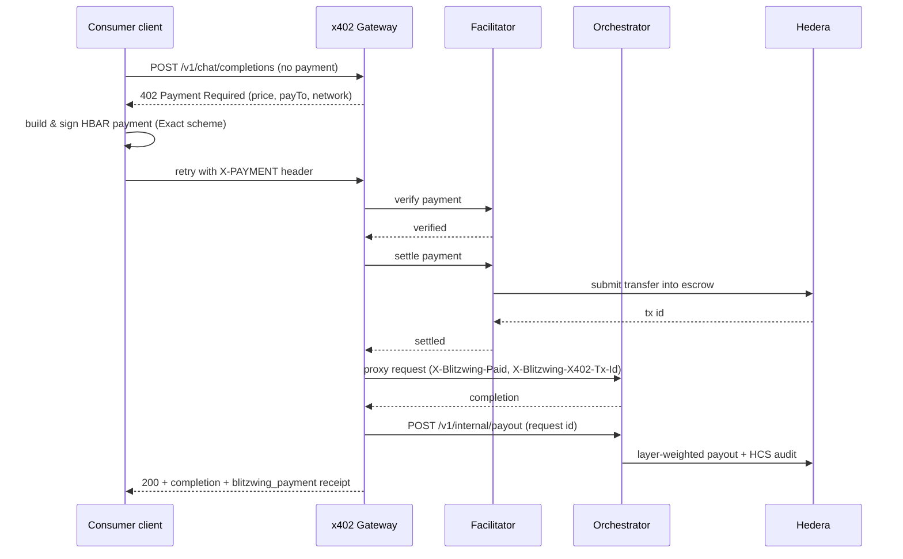

**Pricing.** The price of a request is `TOTAL_LAYERS × COST_PER_LAYER_TINYBARS`. With the defaults of
32 layers and 10,000,000 tinybars per layer, a request costs **320,000,000 tinybars = 3.2 HBAR**, and
each layer is worth **0.1 HBAR**. (Tinybars are Hedera's smallest unit: 100,000,000 tinybars = 1
HBAR.) The x402 payment asset is native HBAR, represented in the scheme as asset `0.0.0` with 8
decimals.

**Settle-before-inference.** A subtle but important design choice: Blitzwing **settles the payment
before running inference**, not after. CPU inference on a distributed swarm can take long enough that a
Hedera transaction signed up front could expire if held until the end. By verifying and settling the
payment into escrow immediately — then running inference — Blitzwing avoids transaction-expiry failures
during slow generation. If inference then fails, the operator reconciles from the logged transaction;
the design prioritizes never losing a valid, signed payment to a timeout.

### The payment gateway and the facilitator

Two small TypeScript services implement the x402 edge:

- **The Gateway (`packages/x402-gateway`, port `8000`)** is the public payment gate that sits in front
  of the orchestrator. It registers the Hedera "Exact HBAR" payment scheme, advertises the price and
  `payTo` target, returns `402` to unpaid requests, and — once a retry carries a valid payment — drives
  verify → settle → proxy-to-orchestrator → payout. It carefully exposes the custom x402 response
  headers via CORS so browser clients (which otherwise can't read them) work. The `payTo` target
  resolves to the escrow contract, which holds the payment until inference completes.
- **The Facilitator (`packages/x402-facilitator`, port `8791`)** is the verify/settle service and the
  fee-payer for settlement. It exposes `/verify`, `/settle`, `/supported`, and `/health`. It is
  deliberately strict: it refuses to boot unless the network resolves to Hedera testnet (mainnet is
  rejected), and it enforces HBAR-only, exact-amount payments. Its signer can fetch a payer's public
  key from the Mirror Node and verify the payment signature, tolerating the quirks of wallet-signed
  transactions.

### Contributor payouts: layer-weighted and automatic

After a successful, paid inference, the orchestrator fans the payment out to everyone who helped. The
rule is simple and transparent: **each online host earns `layers_hosted × cost_per_layer`** for that
request. Host 8 of 32 layers at 0.1 HBAR/layer, and you earn 0.8 HBAR from that request's 3.2 HBAR
pool.

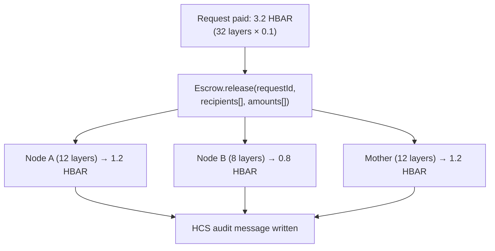

Settlement runs through the **Blitzwing Escrow contract** on Hedera's EVM. The x402 payment settles
into the escrow, and once inference completes the orchestrator calls the contract's `release()` to pay
each recipient their `layers_hosted × cost_per_layer` in a single, trust-minimized on-chain call. The
orchestrator then writes an HCS audit message and returns a payout receipt. The payout endpoint is
guarded: when x402 is enabled, it requires proof that the request was actually paid before it will
release money, so a payout can't be triggered for a freeloading request.

Contributors register their **Hedera account ID** (`0.0.N`) when they join — that, and nothing more, is
all they need to be paid. No private key ever leaves their machine to Blitzwing; the account ID is a
public destination.

### The Blitzwing Escrow contract

Settlement runs through a small, audited-in-spirit Solidity contract, **`BlitzwingEscrow.sol`**,
deployed on Hedera's EVM — the trust-minimized payout rail every request flows through. Its design is
deliberately pool-based, because x402 payments arrive without a request ID attached:

| Member | Kind | What it does |
|--------|------|--------------|
| `operator` | state | The only address allowed to release or refund. |
| `poolBalance` | state | Total HBAR held for distribution. |
| `locked[requestId]` | state | Optional per-request deposits, for refund tracking. |
| `receive()` | payable | Accepts plain HBAR from x402 into the pool; emits `PoolDeposit`. |
| `deposit(requestId)` | payable | Explicit, refund-trackable deposit; emits `Deposited`. |
| `release(requestId, recipients[], amounts[])` | operator-only | Pays each recipient from live balance (locked first, then pool); emits `Released`. This is effectively an operator-gated payment splitter. |
| `refund(requestId, payer)` | operator-only | Refunds a locked deposit; emits `Refunded`. |
| `totalBalance()` | view | The contract's live balance. |

The contract is deployed through Hedera's EVM using the operator's ECDSA key as the `operator`, and
can be seeded with a small HBAR float so the first releases have gas and balance headroom. Because it's
EVM-compatible, it can be built, tested, and deployed with standard Ethereum tooling (Hardhat) against
Hedera's JSON-RPC relay — Hedera testnet uses EVM chain ID `296`. The deployed escrow lives at contract
`0.0.10424668` (EVM `0x00000000000000000000000000000000009f115c`).

### The HCS audit trail

This is Blitzwing's single best demonstration that the system is real. Every payout writes a
consensus-timestamped message to a **Hedera Consensus Service** topic (created on first payout, with
the memo `blitzwing-payouts`). Each message records the full shape of the payout:

```json
{
  "requestId": "chatcmpl-…",
  "x402TxId": "0.0.6111100@…",
  "payoutTxId": "0.0.9211480@…",
  "escrowContractId": "0.0.10424668",
  "costPerLayerTinybars": 10000000,
  "hosts": [
    { "hostId": "host-f5e7d3cdd518", "hederaAccountId": "0.0.6111100", "layersHosted": 8, "amountTinybars": 80000000 }
  ]
}
```

Because HCS messages are ordered and timestamped by the network's consensus — not by Blitzwing — anyone
can pull the topic up on HashScan and confirm that the numbers in a consumer's receipt match an
independent, tamper-evident log written at the moment of payout. The receipt the consumer gets back
(`blitzwing_payment`) references the same topic and sequence number, closing the loop.

### Mirror Node and HashScan verification

Hedera's **Mirror Node** is a free, public REST API mirroring the ledger, and Blitzwing leans on it in
two ways:

- **Operationally**, to resolve an account's EVM alias address when paying an escrow recipient (so
  native transfers target the right address and don't revert), and to fetch a payer's public key when
  verifying a payment signature.
- **For verification**, so that a consumer — or anyone — can confirm a payout landed for the exact
  amount claimed, purely against public infrastructure. **HashScan** is the human-friendly explorer on
  top of the same data; the web UI builds direct HashScan links to transactions, topics, and accounts.

This is the "two public ledgers" promise made concrete: the consumer's receipt points at a Hedera
transaction and an HCS message, and both are checkable by a third party who trusts neither the consumer
nor Blitzwing.

### Wallet signing: HashPack and beyond

Blitzwing supports paying from real wallets, not just server-held keys:

- **Browser (HashPack / WalletConnect).** The Swarm Console builds the x402 payment as a Hedera
  `TransferTransaction`, sets the fee payer from the payment requirements, and hands it to the connected
  wallet to sign. It uses browser-safe base64 encoding for the signed transaction so signing works in
  the browser, and a same-origin proxy so the browser can read the custom x402 response headers. It
  targets Hedera testnet via the standard Hedera wallet-connect stack.
- **Node consumer.** The example paid client builds a client-side Hedera signer (ECDSA preferred) and
  performs the 402 → pay → retry dance programmatically.
- **Facilitator (fee payer).** The settlement service signs and submits the settlement transaction on
  Hedera, acting as the fee payer, and verifies the consumer's signature against their Mirror Node
  public key.

### Hedera configuration reference

These are the operator-side settings (on the mother/gateway host) that control Hedera behavior. **Never
commit real keys** — use a local `.env` and rotate anything that leaks.

| Variable | Meaning |
|----------|---------|
| `X402_ENABLED` | Turn the paid flow on (`1`) or off (`0`, free inference). |
| `COST_PER_LAYER_TINYBARS` | Per-layer price; default `10000000` (0.1 HBAR). |
| `TOTAL_LAYERS` | Layer count for the model; default `32`. Request price = layers × per-layer. |
| `MOTHER_ACCOUNT_ID` / `MOTHER_PRIVATE_KEY` | Escrow operator / fee-payer signer. |
| `FACILITATOR_URL` | Where the gateway reaches the facilitator (default `http://127.0.0.1:8791`). |
| `FACILITATOR_ACCOUNT_ID` / `FACILITATOR_PRIVATE_KEY` | Settlement fee-payer (needs HBAR). |
| `HEDERA_NETWORK` | `hedera-testnet` (mainnet is rejected by the facilitator). |
| `HCS_TOPIC_ID` | Audit topic; created automatically on first payout if empty. |
| `ESCROW_CONTRACT_ID` / `ESCROW_EVM_ADDRESS` | The escrow contract used for settlement and payouts. |
| `X402_PAY_TO` | Override the x402 `payTo` target (e.g. the escrow account). |
| `INFERENCE_TIMEOUT_SECONDS` | Upper bound on a single inference. |

### Where Hedera is heading in Blitzwing

The core loop — pay, infer, pay out, audit — is shipped. The Hedera service menu leaves a lot of room
to deepen it, and the roadmap leans into it:

- **HTS compute credits.** Mint a custom fungible token (`SHARD`) via the Hedera Token Service as a
  closed-loop "compute credit" contributors can redeem, with optional compliance controls (freeze a
  balance flagged for fraudulent compute claims).
- **Scheduled / streamed payouts.** Use Scheduled Transactions to pay recurring "uptime bonuses" to
  hosts that stay online, not just per-request rewards.
- **Batch atomic payouts.** Pay every contributing host for a request in a single atomic batch — all or
  none.
- **File Service manifests.** Store the immutable "who-computed-what" manifest for a request as a
  chain-native Hedera File, separate from the HCS log.
- **Agent Kit integration.** Wire the orchestrator's payment logic through Hedera's agent framework so
  Blitzwing is a first-class Hedera agent.

---

## ENS

If Hedera is where Blitzwing's money moves, **ENS is where its identity lives.** Every node in the
network gets a human-readable, on-chain name that publishes exactly what it does and where it's paid —
so the supply chain behind any answer is independently resolvable by anyone.

> **📂 ENS in the code** — the on-chain identity backbone, end to end:
>
> | What | File |
> |------|------|
> | ENS HTTP API (provision / update / deactivate / resolve) | [`packages/ens-service/src/server.ts`](packages/ens-service/src/server.ts) |
> | On-chain ENSv2 work (resolver + user registry + subname mint + records) | [`packages/ens-service/src/client.ts`](packages/ens-service/src/client.ts) |
> | Record schema + validation (`com.blitzwing.*`) | [`packages/ens-service/src/records.ts`](packages/ens-service/src/records.ts) |
> | Parent name bootstrap | [`packages/ens-service/src/bootstrap-parent.ts`](packages/ens-service/src/bootstrap-parent.ts) · [`packages/ens-service/src/config.ts`](packages/ens-service/src/config.ts) |
> | Orchestrator ENS client (verify / reconcile / replay + payout gate) | [`orchestrator/app/ens_client.py`](orchestrator/app/ens_client.py) |
> | Standalone consumer verifier (resolve on Sepolia, check receipt) | [`examples/ens_verify_client/index.ts`](examples/ens_verify_client/index.ts) |

### Why ENS, and the two-chain split

Blitzwing deliberately splits identity and payment across two chains:

- **Identity on Ethereum (Sepolia) via ENSv2.** Names, records, and verification live here.
- **Payment on Hedera.** Value moves here.

Why not one chain? Because the two jobs have different requirements and different ecosystems. ENS is the
most widely adopted naming system in crypto, with a mature resolver model and universal tooling — ideal
for *identity and discovery*. Hedera is ideal for *fast, cheap settlement*. By linking them — an ENS
name whose records point at a Hedera payout account — Blitzwing gets the best of both and a verification
story that spans two independent public ledgers.

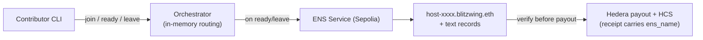

Crucially, ENS is **not** the router — the orchestrator's in-memory registry handles live routing for
speed. ENS is the **verifiable mirror** of that routing: the layer that lets a consumer or a judge
confirm, without trusting the orchestrator, that a node is real, what it serves, and who it pays.

### The host identity backbone

Every host in the swarm gets a subname under the parent **`blitzwing.eth`**:

- The mother is `mother.blitzwing.eth`.
- Each contributor is `host-{8hex}.blitzwing.eth` (the first 8 hex characters of its host ID), for
  example `host-f5e7d3cdd518.blitzwing.eth`.

These are **real, on-chain ENSv2 subnames on Sepolia** — not off-chain, not a CCIP gateway, not a
centralized lookup. The ENS service deploys the operator's resolver and a per-parent user registry the
first time it runs, then mints each host's subname as a token under that registry and writes its
resolver records. The parent name is registered once by the operator (falling back to `blitzwingsep.eth`
if the primary is taken).

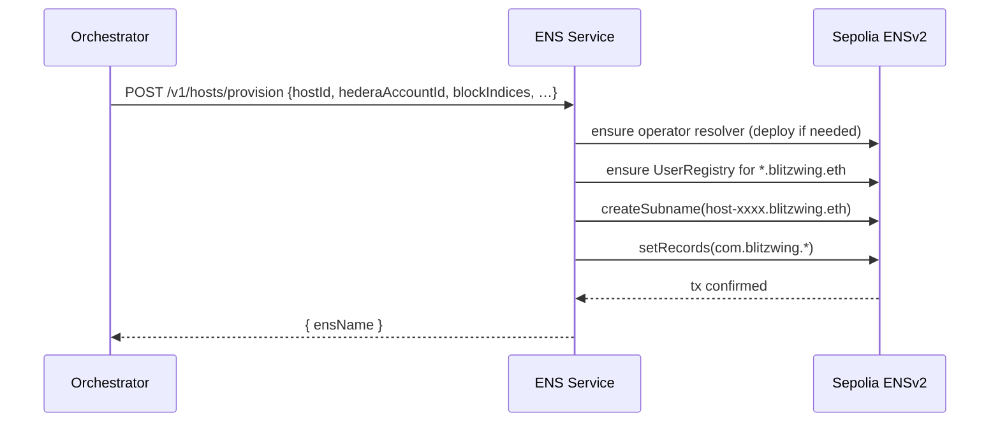

### The resolver record schema

Each host's subname carries a set of namespaced text records under `com.blitzwing.*`. These are the
machine-readable facts anyone can resolve on-chain:

| Text key | Meaning | Example |
|----------|---------|---------|
| `com.blitzwing.hostId` | Stable node id | `host-f5e7d3cdd518` |
| `com.blitzwing.hederaAccountId` | Hedera payout account | `0.0.6111100` |
| `com.blitzwing.blockIndices` | Served layer range `start:end` | `12:20` |
| `com.blitzwing.layersHosted` | Layer count | `8` |
| `com.blitzwing.model` | Model id | `HuggingFaceTB/SmolLM2-360M-Instruct` |
| `com.blitzwing.role` | `mother` or `contributor` | `contributor` |
| `com.blitzwing.status` | `online` or `offline` | `online` |

The records are validated before they're written — a Hedera account must look like `0.0.N`, and a
block range must be a valid `start:end` with `start < end`. The upshot: resolve `host-abc123.blitzwing.eth`
and you learn, from the chain itself, which layers that machine serves and which Hedera account it's
paid to. That's the fact a consumer checks to confirm a receipt isn't fabricated.

### Lifecycle hooks: identity that tracks the swarm

ENS records aren't written once and forgotten — they track the swarm's real state through its lifecycle,
driven by the same orchestrator events that manage routing:

- **On ready (a host joins and is verified serving):** the new host's subname is provisioned with its
  records, and the **donor's** record is updated to reflect its now-narrower range. During a live
  rebalance, you can watch a donor's on-chain `blockIndices` record change the moment the handoff
  completes.
- **On leave / reap (a host departs or dies):** the leaver's name is marked `offline`, and the host that
  reclaims its range has its record updated.
- **On startup:** the mother's own name is synced, pending writes are replayed, and the registry is
  reconciled against the chain.

Failed writes are queued and replayed rather than lost, and verification results are briefly cached to
keep the payout path fast. Because expiry and status are on-chain, the ENS layer can even act as a
liveness signal: a name that stops being renewed or is marked offline simply drops out of the verifiable
set.

### The payout verification gate

ENS isn't just decorative identity — it can gate money. Before paying a host, the orchestrator can
resolve that host's ENS record and compare the on-chain `hederaAccountId`, `blockIndices`, and `hostId`
against its internal registry. Two modes:

- **`ENS_ENABLED=1`** turns on provisioning and updates across join/ready/leave.
- **`ENS_STRICT=1`** makes verification a hard gate: if a host's ENS record is missing or doesn't match,
  its payout is blocked.

Every receipt and every HCS audit message carries the `ens_name`, so the identity and the payment are
bound together in the permanent record. And because resolution is public, a consumer can run the
verification **themselves** — the project ships a standalone verifier that independently resolves a
host's name on Sepolia and confirms the Hedera account in a receipt is the real, registered one.

### The ENS service

All of the on-chain ENS work is encapsulated in a small sidecar, **`packages/ens-service`** (port
`8792`), so the Python orchestrator never has to touch Sepolia directly. It's a TypeScript service
(built on the ENS JavaScript library and viem) exposing a clean HTTP API:

| Endpoint | Purpose |
|----------|---------|
| `GET /health` | Parent name, chain id, operator address. |
| `POST /v1/hosts/provision` | Mint a subname + write records. |
| `POST /v1/hosts/update` | Update a host's records (e.g. new range after rebalance). |
| `POST /v1/hosts/deactivate` | Mark a host `offline`. |
| `GET /v1/hosts/resolve?name=…` | Resolve a host's full record set. |

The orchestrator's Python client wraps these endpoints, adds the verify/reconcile/replay logic, and
persists a local host-id → ens-name mapping so the network's identity survives restarts.

### Who pays for ENS

A core design decision keeps the barrier to contributing at zero: **the operator pays all ENS costs.**
Registering and renewing the parent `.eth` name costs a fee token plus Sepolia gas; minting subnames and
writing records costs Sepolia gas; reads are free. All of that is borne by the company/operator. A
contributor needs **only a Hedera account ID** — no Sepolia wallet, no test ETH, nothing. They get an
on-chain identity for free, paid for by the operator who benefits from the network's verifiability.

### ENS configuration reference

| Variable | Meaning |
|----------|---------|
| `ENS_ENABLED` | Provision/update on join/ready/leave (`1`) or run without ENS (`0`). |
| `ENS_STRICT` | Block payouts when ENS is missing or verification fails. |
| `ENS_PARENT_NAME` | Parent name; default `blitzwing.eth`. |
| `ENS_SEPOLIA_RPC_URL` | Sepolia RPC endpoint. |
| `ENS_OPERATOR_PRIVATE_KEY` | Operator wallet that pays all Sepolia costs. |
| `ENS_SERVICE_URL` | Where the orchestrator reaches the ENS sidecar (default `http://127.0.0.1:8792`). |

### Designed for ENSv2: the primitives we build on

The implemented backbone — on-chain subnames, `com.blitzwing.*` records, lifecycle updates, and a payout
verification gate — is the foundation. But Blitzwing was architected against the full ENSv2 feature set,
and each advanced primitive maps to a concrete job on the roadmap. These are the capabilities we're
building toward; they're listed here so the design direction is clear.

| ENSv2 primitive | The job it does in Blitzwing |
|-----------------|------------------------------|
| **Hierarchical registries** | A host running multiple GPUs can go a level deeper — `layer3.host7.blitzwing.eth`, `layer9.host7.blitzwing.eth` — one operator, many independently managed shard-slots. |
| **Permissioned (tokenized) subnames** | A host's registration is a transferable token: selling your "slot" (hardware + reputation) to another operator becomes an NFT transfer, not a manual re-registration. |
| **Permissioned resolver (one per account)** | Update your Hedera payout address **once** and it updates across every name you own — a real efficiency win for multi-machine operators. |
| **Enhanced Access Control (roles)** | Role-based permissions: hosts own their payout field, the orchestrator sets compute tier after a benchmark, the admin can suspend. A demoable security model. |
| **Resolver aliasing (`setAlias`)** | Failover: a standby machine aliases to a primary's records and inherits its identity instantly when the primary drops. |
| **Namespace aliasing** | Onboard a whole GPU farm (`farm1.blitzwing.eth`) under one shared registry in a single operation instead of dozens. |
| **Wildcard resolution** | Cheap, ephemeral spot hosts (`*.burst.blitzwing.eth`) resolve dynamically without paying gas to register a machine that'll be gone in an hour. |
| **Expiry as a liveness signal** | A host that stops renewing becomes immediately unresolvable and drops out of routing — no separate heartbeat oracle needed. |
| **Universal Resolver V2** | The orchestrator resolves a name's full record set in a single call instead of walking registry → resolver → record. |
| **Record versioning** | When a slot changes hands, wipe stale records in one call, bumping a version number cleanly. |
| **Reverse resolution** | Reverse-resolve deployed contracts (like the escrow) to an ENS name, so on-chain identity is symmetric with the hosts it pays. |

---

## Getting Started

There are three ways to get into Blitzwing. Most people want the first — **join the network and earn**.
Developers who want to *consume* inference want the second. Operators who want to run a swarm want the
third.

### Prerequisites

| Requirement | Why |
|-------------|-----|
| **Linux or WSL** | The compute engine needs Linux. On Windows, install and run everything inside WSL — native Windows is not supported for contributing. |
| **Node.js ≥ 18** | Runs the `blitzwing` CLI. |
| **Python 3.10 or 3.11** | Runs the local inference runtime. **3.12+ is not supported.** The CLI will guide you to pin 3.11 with `uv` if needed. |
| **A Hedera testnet account** | Your `0.0.N` account ID receives HBAR payouts. Create one at the Hedera Developer Portal and fund it from the faucet. You never share your private key. |

### Join the network as a contributor

This is the headline experience. One command installs the CLI; one more joins the swarm.

```bash
npm i -g blitzwing
blitzwing
```

> **On Windows:** open a **WSL** shell first, install Node inside WSL, then run the two commands there.

The interactive wizard then walks you through everything:

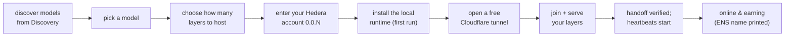

1. **Discover.** The CLI reads the available models from the Discovery Service — you never type a mother
   URL.
2. **Pick a model and layer count.** It shows how many layers are currently available and asks how many
   your machine can host. CPU-only is fine for the default model.
3. **Enter your Hedera account ID** (`0.0.N`) for payouts.
4. **Install the runtime.** On first run it creates a Python virtual environment and installs the
   CPU-only inference stack. Nothing to clone — the runtime ships inside the npm package.
5. **Open a tunnel.** A free Cloudflare Quick Tunnel exposes your shard manager publicly — no account,
   no port forwarding.
6. **Join, serve, and go online.** It requests a layer assignment, starts serving, finalizes the
   handoff, and starts a heartbeat daemon. On success it prints your block range and, when ENS is
   enabled, your `host-….blitzwing.eth` name.

**Managing your node:**

```bash
blitzwing status     # model, host id, layers, block range, mother, tunnel, Hedera account, ENS name, live state
blitzwing leave      # gracefully leave; your layers are reclaimed by the swarm
blitzwing help       # usage
```

**Non-interactive / CI join** (everything via env vars, no prompts):

```bash
export BLITZWING_HEDERA_ACCOUNT_ID=0.0.123456
export BLITZWING_LAYERS=8
export BLITZWING_NONINTERACTIVE=1
blitzwing
```

**Pinning Python 3.11 with `uv`** (if your system Python is 3.12+):

```bash
curl -LsSf https://astral.sh/uv/install.sh | sh
source "$HOME/.local/bin/env"
uv python install 3.11
export BLITZWING_PYTHON="$(uv python find 3.11)"
blitzwing
```

**Running on a public cloud VM** (best for always-on contributors): provision a Linux VM, open inbound
TCP `31337` (swarm P2P) and `8001` (shard manager), install Node 18+ and Python 3.11, then
`npm i -g blitzwing && blitzwing` and choose the public-IP option. The provisioning and join scripts
live in [`scripts/`](scripts), and the CLI wizard itself in [`packages/cli/src/`](packages/cli/src).

For the full CLI reference — every command, flag, and environment variable — see
[`packages/cli/README.md`](packages/cli/README.md).

### Consume inference

**Free / local (no payment).** The simplest client is a dependency-free Python script that speaks the
OpenAI chat API:

```bash
export BLITZWING_BASE_URL=http://<mother-host>:8000/v1
python examples/chat_client.py -q "Explain distributed inference in one sentence."
```

It supports `--base-url`, `--model`, `--system`, `-q/--query`, `--max-tokens`, `--temperature`, and
`--stream`. Point it at a local mother for a free swarm, or at a paid gateway when you have payment set
up.

**Paid (x402 + Hedera), programmatic.** The Node example client performs the full 402 → pay → retry
loop and prints the `blitzwing_payment` receipt:

```bash
cd examples/x402_chat_client
npm install && npm start
```

It needs a Hedera account for the payer and a running gateway (`:8000`) + facilitator (`:8791`).

**Paid, in a browser with HashPack.** Run the Swarm Console, connect a HashPack wallet, and click
**Run** to sign an x402 payment client-side against the live gateway:

```bash
cd web-ui
cp .env.example .env
# set VITE_WALLETCONNECT_PROJECT_ID from https://cloud.reown.com
npm install --legacy-peer-deps
npm run dev
```

---

## Roadmap

Blitzwing's philosophy is "a rock-solid core loop first, depth on top of a working spine." The core —
split a model, route a request, pay contributors per layer, audit on HCS, and verify identity on ENS —
is shipped and demonstrable today. Everything beyond that layers onto that working foundation.

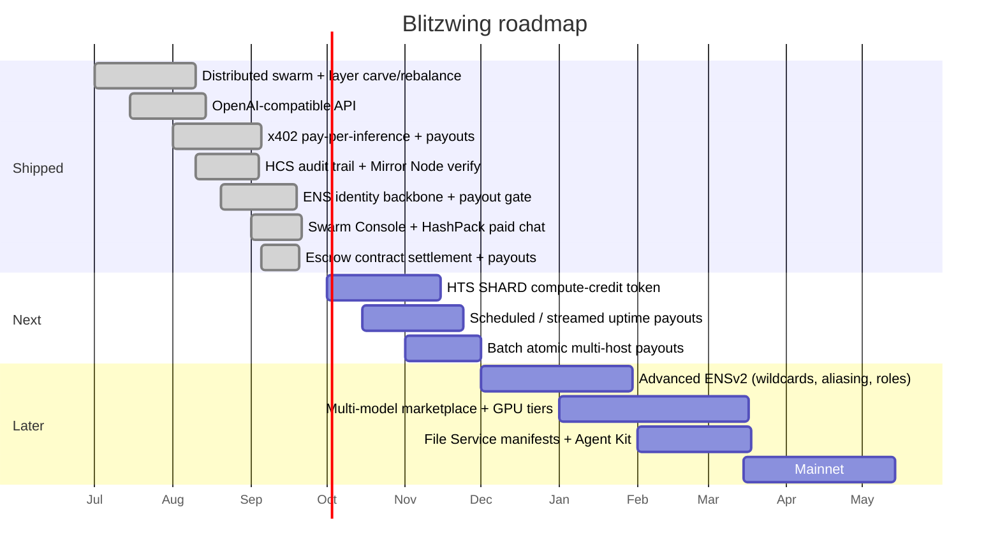

**Now (shipped).** The distributed swarm with live layer carving and "shrink and hand off" rebalancing;
the OpenAI-compatible API with streaming; x402 pay-per-inference with layer-weighted HBAR payouts
settled through the on-chain **escrow contract**; the HCS audit trail and Mirror Node verification; the
ENS identity backbone with a payout verification gate; and the Swarm Console with real HashPack paid chat.

**Next.** Introduce an **HTS `SHARD` token** as a closed-loop compute credit with compliance controls;
add **scheduled/streamed uptime payouts** to reward reliable hosts beyond per-request rewards; and make
every request's payout a **single atomic batch**.

**Later.** Roll out the advanced ENSv2 primitives (wildcard burst hosts, failover aliasing,
role-based access control, tokenized transferable slots); open a **multi-model marketplace** with GPU
tiers so larger machines can serve larger models; record per-request manifests via the Hedera **File
Service** and wire the orchestrator through the **Hedera Agent Kit**; and graduate from testnet to
**mainnet**.

---

## Frequently Asked Questions

**Do I really not need a GPU?**
Correct. The default model is small enough that a slice of its layers runs on a normal CPU. You choose
how many layers to host based on your machine. A GPU lets you take a bigger slice, but it is not
required to participate or to earn.

**Do I need a public IP or to configure my router?**
No. The CLI opens a free Cloudflare tunnel for you, so a laptop behind a home router can join without
any port forwarding. If you *do* have a public IP (e.g. a cloud VM), you can use it directly for better
performance.

**How much do I earn?**
Per request routed through the swarm, you earn `layers_hosted × per-layer price`. With defaults, each
layer is worth 0.1 HBAR, so hosting 8 layers earns 0.8 HBAR per request you help serve. Earnings scale
with your layer count and the swarm's traffic.

**Do I have to hand over my private keys?**
Never. Contributors provide only a Hedera **account ID** (`0.0.N`) — a public destination for payouts.
Your keys stay on your machine. Operators hold their own keys locally and should never commit them.

**What happens if my machine goes offline mid-session?**
Your heartbeats stop, the reaper reclaims your layers within about a minute, and the swarm re-covers your
range from the mother or an adjacent host. When you come back, you re-join cleanly. You simply stop
earning while you're away.

**Is this on mainnet?**
Not yet — everything runs on Hedera Testnet and Ethereum Sepolia today. Mainnet is on the roadmap.

**Why two chains?**
Identity and payment have different needs. ENS (on Ethereum/Sepolia) is the best naming and
verification layer; Hedera is the best fast, cheap settlement layer. Linking them gives a verification
story that spans two independent public ledgers — you don't have to trust Blitzwing for either claim.

**Which models are supported?**
SmolLM2-360M is the deployed default because it makes the "join with a laptop" experience real. The
architecture is model-agnostic and the engine supports additional families (BLOOM, Falcon, Llama,
Mixtral, Qwen3); operators can run other models and register them with discovery.

**What does a consumer actually get as proof?**
A `blitzwing_payment` receipt listing which ENS-named hosts computed which layers and the Hedera
transaction IDs for each payout — all independently checkable on HashScan, the Mirror Node, the HCS
topic, and the Sepolia ENS app.

---

## Conclusion

Blitzwing is built on a bet that's easy to state and hard to fake: **the world already has the compute
it needs for inference — it's just idle, scattered, and unpaid.** By splitting a model across ordinary
machines, routing each request through them, and paying each machine for exactly the work it did,
Blitzwing turns that idle capacity into a living, earning network that anyone can join with a laptop and
a Hedera account.

What makes it more than a demo is the insistence on verifiability. A consumer doesn't have to believe a
brand when they call the API — they get a receipt, and every line of that receipt is checkable on two
independent public ledgers. A contributor doesn't have to wait for a payout portal or trust an invoice —
the HBAR lands in their account within seconds, with a consensus-timestamped audit entry to match. An
operator doesn't have to build a trust story from scratch — ENS gives every node a resolvable identity
and Hedera gives every payment a public record.

That combination — **distributed inference, priced on Hedera, named on ENS, open to GPU-less hardware,
and auditable by anyone** — is the thing worth building, and the thing worth joining.

**Ready to dive in?**

- **Earn from idle compute:** `npm i -g blitzwing && blitzwing`
- **Build on cheap, auditable inference:** point your OpenAI client at a Blitzwing gateway.
- **Run your own swarm:** start with the [orchestrator](orchestrator/app) and the [`scripts/`](scripts) bootstrap tooling.
- **Follow the project:** https://github.com/Marshal-AM/blitzwing

---

## License

Blitzwing's own code is released under the **MIT License**. The vendored distributed-inference runtime
retains its original upstream open-source license; see the in-repo runtime directory for its terms.

<div align="center">

**Blitzwing** — *idle machines, a shared brain, verifiable pay.*

Built with Hedera and ENS.

</div>
